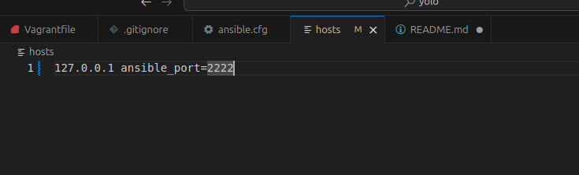
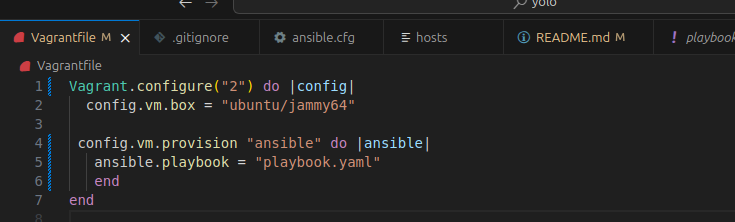
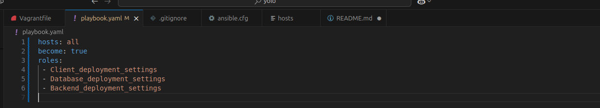

# **Infrastructure as code (iac) using Ansible and Vagrant**
The role of this IP3 is to test the learners the knowledge of infrastructure as code using Ansible for server configurations and vagrant to create virtual machines. We will use the same react application done in IP2 and deploy the application in a vm. All configurations done using docker containers should be done in ansible playbook.

## **CREATE VIRTUAL MACHINES USING VAGRANT**

## run vagrant commands for initialization
`vagrant status`
`vagrant box list`

### See the results of the above commands


## vagrant version

`vagrant version`


## Create a vagrant file in the root directory

`vagrant init ubuntu/jammy64`

## Spin up the virtual machine using the vagrant file created

`vagrant up`

## ssh into running virtual machine spinned by vagrant which takes you inside ubuntu jammy

`vagrant ssh`

## Typically how to ssh a machine

`ssh user@ipaddress -p port -i private_key`

## to see the vagrant virtual machine version and its details. You should be inside the vagrant vm

`cat /etc/*release`


## To get ssh configurations that vagrant is using

`vagrant ssh-config`

## to stop a vagrant virtual machine use:

`vagrant halt`

# **ANSIBLE**

## To see ansible version

`ansible version`

## To list a group of ansible files use:

`ls /etc/ansible`


## Since we want to track the ansible files, I will recreate them in the root folder

`touch ansible.cfg` `touch hosts` `mkdir roles` `touch playbook.yaml`

## Created ansible file with settings of the virtual machine


## In the hosts folder, details of the virtual machine like IP address and Port number are included



## Include ansible playbook in vagrant file

```ruby
Vagrant.configure("2") do |config| 
  config.vm.box = "geerlingguy/ubuntu2004"

 config.vm.provision "ansible" do |ansible|
   ansible.playbook = "playbook.yaml"
   end
end

```


## commission the playbook though empty for now

`vagrant provision`

## Create roles that groups same tasks together using Ansible Galaxy

Ansible galaxy will help in grouping similar tasks together as roles
We will deploy three roles based on the application setup (Frontend/client, Backend, Database)

`ansible-galaxy init Backend_deployment_settings`

`ansible-galaxy init Client_deployment_settings`

`ansible-galaxy init Database_deployment_settings`


## Call the roles from ansible playbook.yaml file




## Backend role main.yaml file in the tasks folder

```yaml

- name: Check whether docker network exists before the container runs
  docker_network:
   name: apt-network
   state: present

- name: pull docker image from the docker hub
  docker_image:
   name: vokemwa/vincent-yolo-backend:v1.0.0    ## downloads my backend image that I pushed to docker hub
   source: pull                                 


## this task creates and runs a docker container that I pushed to docker hub repository
- name: Run vincent-yolo-backend container
  docker_container:
    name: vincent-yolo-backend                               ## The name of the container in the repository
    image: vokemwa/vincent-yolo-backend:v1.0.0               ## Dockerhub usernamme/container name:tag
    networks:
      - name: vincent-network
    ports:
      - "5000:5000"                                          # Mapping of host port 5000 to container port 5000. Therefore your backend app will be accessible on http://localhost:5000
    command: "npm start"                                     # This is the command Docker will run when starting the container. Here, it starts the Node.js backend using npm start
    restart_policy: always                                   # Ensures Docker will automatically restart the container if it stops or the system reboots.


```

## Backend main.yaml file in the vars folder

```yaml

container_name: vincent-yolo-backend
network: vincent-network


```