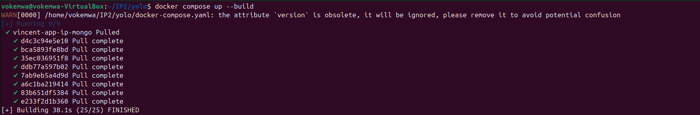
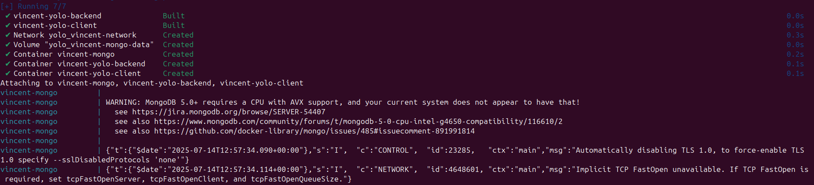
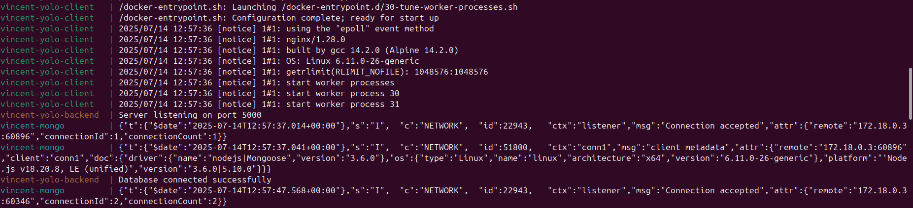
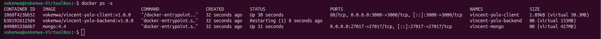
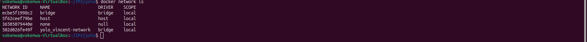

# **Containerizing A micro service Application**

The role of this project is to containerize a react application and use containers to deploy the application as a microservice

# CREATE DOCKER-FILES 
Create Dockerfiles for both frontend and backend. 
### Create frontend dockerfile command 
`touch client/Dockerfile`

### Create backend dockerfile file
`touch backend/Dockerfile`

## **Write the contents of Frontend Dockerfile**
#### The build stage: Choose light weight image
`FROM node:18-alpine AS builder`

#### Create a working directory. I decided to use `/app` for simplicity
`WORKDIR /app`

#### Copy package.json and package-lock.json from the local folder to the working directory
`COPY package*.json ./`

#### Install the application dependencies. Used `npm ci` which is more faster, more reliable and clearner
`RUN npm ci`

#### Copy everything in the current directory to the current working directory which is inside the image
`COPY . .`

#### Build the app
`RUN npm run build`

#### Production stage2: For multistage builds, am using nginx to serve the application. Have used nginx coz it's light weight and faster. 

`FROM nginx:stable-alpine AS prod`

#### copy contents of the React APP build output above to the public nginx directory. It actually copies the contents of the build to the directory where nginx serves static files

`COPY --from=builder /app/build /usr/share/nginx/html`

### **Compressed commands for Backend nodeJS**

## Dockerfile (Client)

```dockerfile
FROM node:18-alpine AS builder
WORKDIR /app
COPY package*.json ./
RUN npm ci
COPY . .
ENV NODE_OPTIONS=--openssl-legacy-provider
RUN npm run build

FROM nginx:stable-alpine AS prod
COPY --from=builder /app/build /usr/share/nginx/html
EXPOSE 80

```
 ## **Write the contents of Backend (NodeJS) Dockerfile**
 #### Stage1: Build- The first build stage using node.js V18 and alpine linux distro(light weight)

 `FROM node:18-alpine AS build`


#### Sets the working directory

`WORKDIR /app`

#### Copies packages files and installs only production dependencies

`COPY package*.json ./`

#### Continous integration (ci) installs dependencies based strictly on `package-lock.json` file

`RUN npm ci --omit=dev && npm cache clean --force`

#### Copies the rest of the application source code from the host to the container i.e. Copies everything into the container
`COPY . .`

#### Stage2: Runtime: a fresh, second image that uses only what is needed to run the application

`FROM node:18-alpine AS runtime`

#### Set the working directory inside the runtime container

`WORKDIR /app`

#### copies everything from the /app directory in the build stage into the new runtime container

`COPY --from=build /app /app`

#### Expose the Application port
`EXPOSE 5000`

#### Start the server
`CMD ["node", "server.js"]`

#### **Compressed commands for Backend nodeJS**

## Dockerfile (backend)

```Dockerfile
FROM node:18-alpine AS build
WORKDIR /app
COPY package*.json ./
RUN npm ci --omit=dev && npm cache clean --force
COPY . .

FROM node:18-alpine AS runtime
WORKDIR /app
COPY --from=build /app /app
EXPOSE 5000
CMD ["node", "server.js"]

```

# CREATE DOCKER-COMPOSE

#### `docker-compose.yaml` Configuration

This configuration sets up three microservices: **Frontend (React)**, **Backend (Node.js)**, and **MongoDB**, along with a custom network and volume for persistent storage.


#### Indicate the file format version
`version: "3.8"`

#### Services: They define each microservice container
`services:`

###  **Frontend microservice**
  `vincent-yolo-client:`
####  Docker Hub username, image name and tag
 `image: vokemwa/vincent-yolo-client:v1.0.0`   
####  Build the context for frontend dockerfile        
  `build: ./client`  
#### Custom name for the frontend container
`container_name: vincent-yolo-client`  
#### Keeps stdin open (useful for debugging)
`stdin_open: true` 
#### Simulates a real terminal                                      
`tty: true`  
#### Host port mapped to container port                                            
`ports:`
    `- "3000:3000"`   

#### Ensures backend starts before this container
`depends_on:`
      `- vincent-yolo-backend`    
#### Connects to shared network                           
`networks:`
      `- vincent-network`                                    

  ### **Backend microservice**
  `vincent-yolo-backend:`
#### Docker image and tag for backend
`image: vokemwa/vincent-yolo-backend:v1.0.0 ` 
#### Build context for backend
`build: ./backend `   
#### Custom name for backend container                                  
`container_name: vincent-yolo-backend ` 
#### Keeps stdin open (debugging)
   `stdin_open: true `  
#### Simulates a real terminal                                    
   `tty: true  `  
#### Auto-restarts container on crash/reboot                                          
`restart: always `   
#### Host port mapped to backend app port
`ports:`
      `- "5000:5000" `  
#### Waits for MongoDB before starting                                     
`depends_on:`
      `- vincent-app-ip-mongo`   
#### Connects to shared network                           
  `networks:`
      `- vincent-network`                                    

  ### **MongoDB microservice**

  `vincent-app-ip-mongo:`

#### Official MongoDB image
`image: mongo:4.4 `   
#### Custom name for MongoDB container
`container_name: vincent-mongo`  
#### Maps default MongoDB port
`ports:`
      `- "27017:27017" `  
#### Shared network access                                   
`networks:`
      `- vincent-network`  
#### Uses Docker-managed named volume                                  
`volumes:`
      `- type: volume`    
#### Name of volume
`source: vincent-mongo-data ` 
#### Default MongoDB data directory in container
`target: /data/db `                                  

### **Docker Network**
`networks:`
  `vincent-network:`
#### Default bridge network
`driver: bridge ` 
#### Other containers can join
` attachable: true `                                       

# Docker Volumes
`volumes:`
  `vincent-mongo-data:`
#### Local persistent volume
`driver: local`                                          
    
#### **Docker Compose Configuration**
```yaml
version: "3.8"

services:
  vincent-yolo-client:
    image: vokemwa/vincent-yolo-client:v1.0.0
    build: ./client
    container_name: vincent-yolo-client
    stdin_open: true
    tty: true
    ports:
      - "3000:3000"
    depends_on:
      - vincent-yolo-backend
    networks:
      - vincent-network

  vincent-yolo-backend:
    image: vokemwa/vincent-yolo-backend:v1.0.0
    build: ./backend
    container_name: vincent-yolo-backend
    stdin_open: true
    tty: true
    restart: always
    ports:
      - "5000:5000"
    depends_on:
      - vincent-app-ip-mongo
    networks:
      - vincent-network

  vincent-app-ip-mongo:
    image: mongo:4.4
    container_name: vincent-mongo
    ports:
      - "27017:27017"
    networks:
      - vincent-network
    volumes:
      - type: volume
        source: vincent-mongo-data
        target: /data/db

networks:
  vincent-network:
    driver: bridge
    attachable: true

volumes:
  vincent-mongo-data:
    driver: local

```

### When the docker-compose file is complete and ready to be deployed, run the following commands in your terminal

#### If docker compose is not installed in your machine, run the following commands:
`sudo apt update`
`sudo apt install docker-compose`

#### Run docker compose command in your root folder
`docker-compose up --build`

### See the results of the images downloading




### See the results of the of the containers running




### See the results of the database connection



### see the results of running containers



### see results for running networks



### see results for docker-hub images

