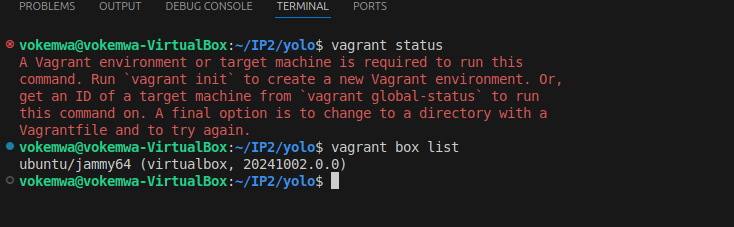
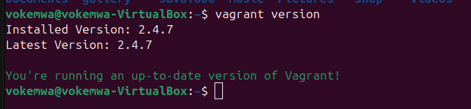
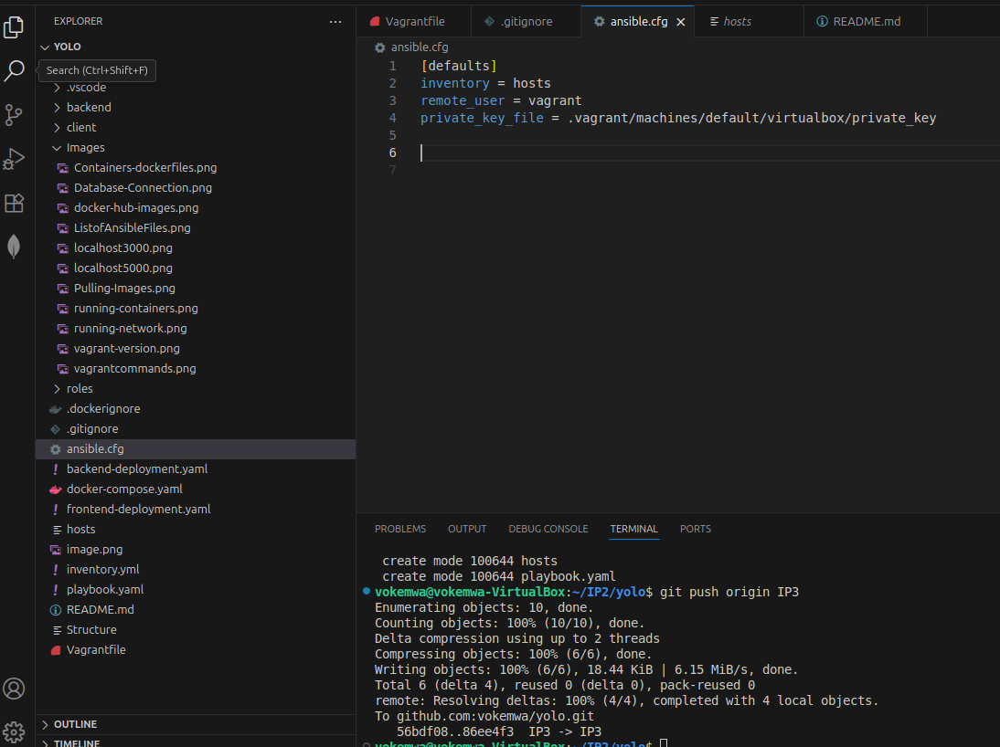

# **Infrastructure as code (iac) using Ansible and Vagrant**
The role of this IP3 is to test the learners the knowledge of infrastructure as code using Ansible for server configurations and vagrant to create virtual machines. We will use the same react application done in IP2 and deploy the application in a vm. All configurations done using docker containers should be done in ansible playbook.

## **CREATE VIRTUAL MACHINES USING VAGRANT**

## run vagrant commands for initialization
`vagrant status`
`vagrant box list`

### See the results of the above commands

## vagrant version

`vagrant version`

## Create a vagrant file in the root directory

`vagrant init ubuntu/jammy64`

## Spin up the virtual machine using the vagrant file created

`vagrant up`

## ssh into running virtual machine spinned by vagrant which takes you inside ubuntu jammy

`vagrant ssh`

## Typically how to ssh a machine

`ssh user@ipaddress -p port -i private_key`

## to see the vagrant virtual machine version and its details. You should be inside the vagrant vm

`cat /etc/*release`

## To get ssh configurations that vagrant is using

`vagrant ssh-config`

## to stop a vagrant virtual machine use:

`vagrant halt`

# **ANSIBLE**

## To see ansible version

`ansible version`

## To list a group of ansible files use:

`ls /etc/ansible`

## Since we want to track the ansible files, I will recreate them in the root folder

`touch ansible.cfg` `touch hosts` `mkdir roles` `touch playbook.yaml`

## Created ansible file with settings of the virtual machine

