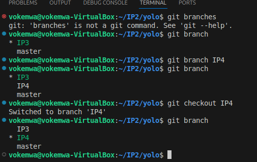
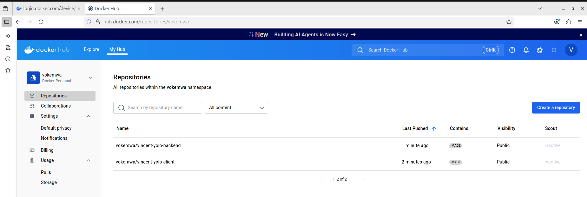
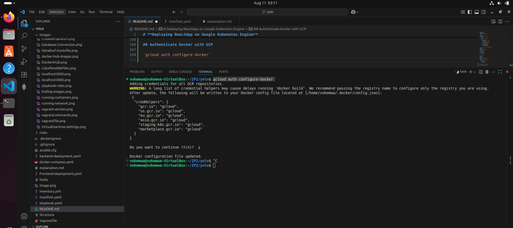
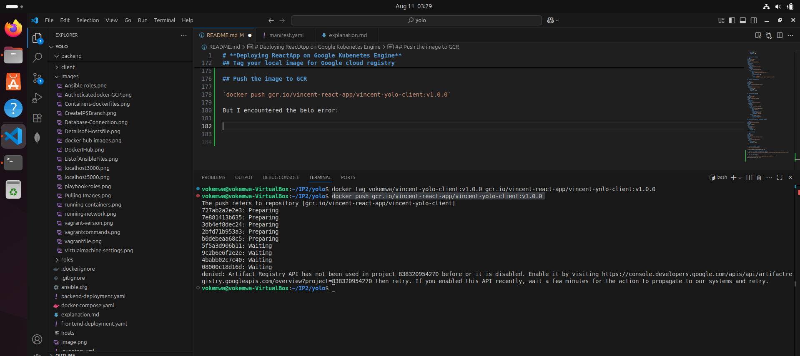
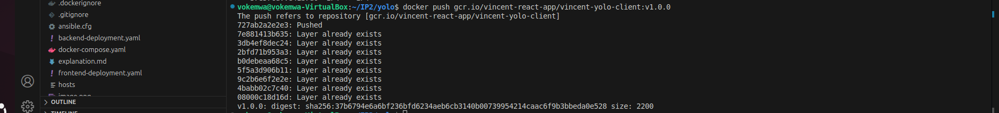
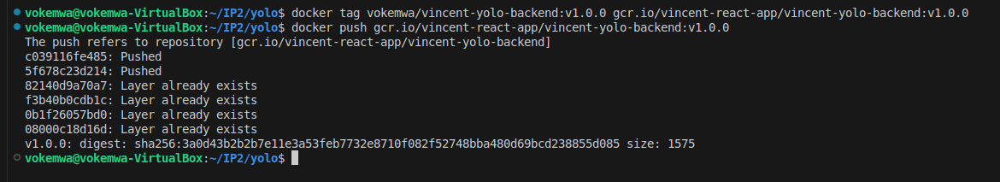
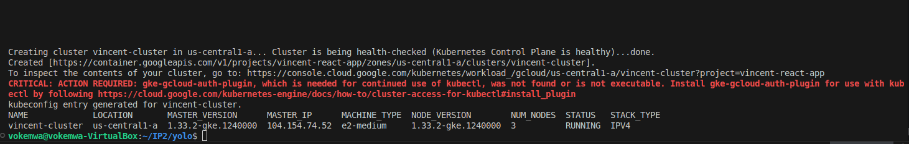
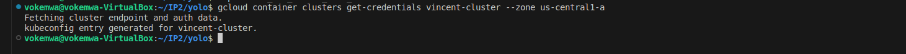

# **Deploying ReactApp on Google Kubenetes Engine**
The role of this IP4 is to orchastrate/host the ReactAPP on Google Kubenetes Engine (GKE) so as to be reachable via internet, use stateful set to deploy mongoDB and persistent volumes.

## First, let's create a new branch for IP4 



## I had already pushed my docker images to docker hub for the frontend and backend images



## create a manifest.yaml file

`touch manifest.yaml`


## Front end Deployment

```yaml
apiVersion: apps/v1
kind: Deployment
metadata:
  name: vincent-yolo-client
spec:
  replicas: 2
  selector:
    matchLabels:
      app: vincent-yolo-client
  template:
    metadata:
      labels:
        app: vincent-yolo-client
    spec:
      containers:
        - name: vincent-yolo-client
          image: vokemwa/vincent-yolo-client:v1.0.0
          ports:
            - containerPort: 80

```

## steps for frontend service
```yaml
apiVersion: v1
kind: Service
metadata:
  name: vincent-yolo-client-service
spec:
  type: LoadBalancer
  selector:
    app: vincent-yolo-client
  ports:
    - protocol: TCP
      port: 3000
      targetPort: 80

```

## Deployment for backend

```yaml
apiVersion: apps/v1
kind: Deployment
metadata:
  name: vincent-yolo-backend
spec:
  replicas: 2
  selector:
    matchLabels:
      app: vincent-yolo-backend
  template:
    metadata:
      labels:
        app: vincent-yolo-backend
    spec:
      containers:
        - name: vincent-yolo-backend
          image: vokemwa/vincent-yolo-backend:v1.0.0
          ports:
            - containerPort: 5000
          env:
            - name: MONGO_URL
              value: mongodb://vincent-app-ip-mongo-service:27017
```

## Steps for backend service

```yaml
apiVersion: v1
kind: Service
metadata:
  name: vincent-yolo-backend-service
spec:
  selector:
    app: vincent-yolo-backend
  ports:
    - protocol: TCP
      port: 5000
      targetPort: 5000
```


## Deployment for MongoDB

```yaml
apiVersion: apps/v1
kind: Deployment
metadata:
  name: vincent-app-ip-mongo
spec:
  replicas: 1
  selector:
    matchLabels:
      app: vincent-app-ip-mongo
  template:
    metadata:
      labels:
        app: vincent-app-ip-mongo
    spec:
      containers:
        - name: vincent-app-ip-mongo
          image: mongo:4.4
          ports:
            - containerPort: 27017
          volumeMounts:
            - name: mongo-storage
              mountPath: /data/db
      volumes:
        - name: mongo-storage
          persistentVolumeClaim:
            claimName: mongo-pvc
```

## Persistent volume claim for mongodb databse

```yaml
apiVersion: v1
kind: PersistentVolumeClaim
metadata:
  name: mongo-pvc
spec:
  accessModes:
    - ReadWriteOnce
  resources:
    requests:
      storage: 5Gi
```

## MongoDB service

```yaml
apiVersion: v1
kind: Service
metadata:
  name: vincent-app-ip-mongo-service
spec:
  selector:
    app: vincent-app-ip-mongo
  ports:
    - protocol: TCP
      port: 27017
      targetPort: 27017
```


## Authenticate Docker with GCP

`gcloud auth configure-docker`



## Tag your local image (Frontend)for Google cloud registry

`docker tag vokemwa/vincent-yolo-client:v1.0.0 gcr.io/vincent-react-app/vincent-yolo-client:v1.0.0`

## Push the image (Frontend) to GCR

`docker push gcr.io/vincent-react-app/vincent-yolo-client:v1.0.0`

But I encountered the belo error:



I sorted this by enabling Artifact Registry API on google cloud console then I re-run my command

`docker push gcr.io/vincent-react-app/vincent-yolo-client:v1.0.0`



## Tag your local image (Backend)for Google cloud registry

`docker tag vokemwa/vincent-yolo-backend:v1.0.0 gcr.io/vincent-react-app/vincent-yolo-backend:v1.0.0`

## Push the image (Backend) to GCR

`docker push gcr.io/vincent-react-app/vincent-yolo-backend:v1.0.0`




## Create a GKE cluster:

`gcloud container clusters create vincent-cluster --zone us-central1-a --num-nodes=3`

But there is an error


I sorted this by reducing Reduce Node Boot Disk Size

`gcloud container clusters create vincent-cluster --zone us-central1-a --num-nodes=3 --disk-size=80GB`



## From the error above

Install the gke-gcloud-auth-plugin so kubectl can connect to your cluster:

`sudo apt-get install google-cloud-sdk-gke-gcloud-auth-plugin`


## get the cluster

`gcloud container clusters get-credentials vincent-cluster --zone us-central1-a`

